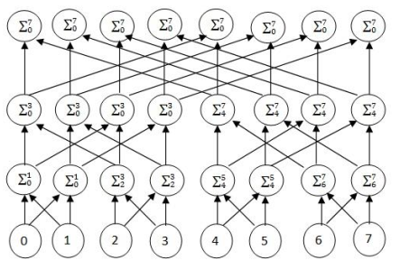

# Assignment 5

Consider the summation of n numbers problem where n numbers were distributed across p
processing nodes and the sum of all those numbers has to be transmitted to all nodes. You have
to write an MPI program that would sum the n numbers using replicated computation. As
example of replicated computation is shown below (Note: this is a sample example only, you
will solve for general n and p values where n≥p).

* Each of the p nodes should randomly choose n/p.
* The summation should be available in all nodes at the end of execution.
* n >= p

